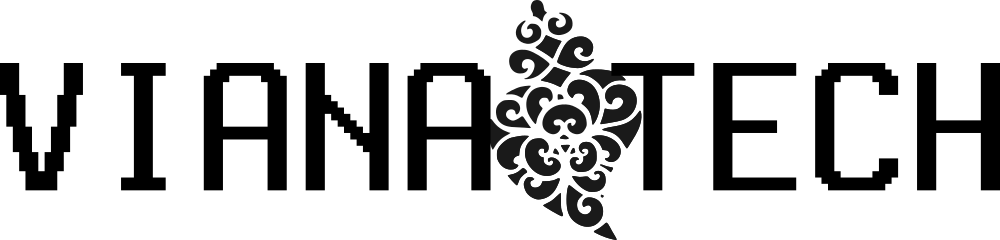

# Welcome to Viana Tech

Viana Tech is your hub for innovation and connection in the North of Portugal. We are a non-profit organization dedicated to fostering a thriving community of technology enthusiasts, software developers, and innovators. Whether you’re a seasoned developer, a tech entrepreneur, or just starting your journey in programming, Viana Tech is the place where you belong.

## What We Do

At Viana Tech, we organize gatherings and meetups that bring together curious minds to explore the ever-evolving world of technology. Our events are designed to:

- **Discuss Programming Languages:** From Python and Rust to the latest emerging trends, dive deep into the tools shaping the future.
- **Explore New Techniques:** Share and discover best practices in software development and problem-solving.
- **Learn Cutting-Edge Tools:** Stay ahead with hands-on discussions about the tools transforming the tech landscape.

## Who’s Welcome?

Everyone! Our community thrives on diversity. If you are passionate about technology and innovation, we’d love to have you join us. No matter your level of experience or area of expertise, there’s a place for you here.

## Why Join Us?

- **Collaborate:** Meet like-minded individuals who share your passion for tech.
- **Learn:** Gain new insights, improve your skills, and stay informed about industry trends.
- **Inspire:** Share your knowledge and inspire others while being inspired by their journeys.

## Upcoming Events

Be part of our vibrant community by attending our next meetup! Stay tuned for details on our upcoming gatherings.

## Get Involved

Ready to connect with a dynamic tech community in Viana do Castelo and beyond? Join our events, share your ideas, or even help us organize! Together, we can drive innovation and make a difference in the tech world.

### Contact Us

Email: [info@vianatech.org](mailto:info@vianatech.org)  

**Let’s build the future of technology together at Viana Tech!**

